# kaven-proxy

[docker pull kavenzero/kaven-proxy](https://hub.docker.com/r/kavenzero/kaven-proxy)

## Proxy Process Illustration

```mermaid
flowchart LR
    U[User App or Browser]
    LP[Local HTTP Proxy\nCLIENT_HTTP_HOST:CLIENT_HTTP_PORT]
    C[Client Mode Proxy\nCLIENT=true]
    TLS[(Encrypted Proxy Tunnel\nCLIENT_CONNECT_HOST:CLIENT_CONNECT_PORT)]
    S[Server Mode Proxy\nSERVER=true\nSERVER_HOST:SERVER_PORT]
    T[Target Service / Internet]

    U -->|HTTP request| LP
    LP -->|forward request| C
    C -->|encrypt + tunnel| TLS
    TLS -->|decrypt + route| S
    S -->|outbound request| T
    T -->|response| S
    S -->|encrypted response| TLS
    TLS -->|decrypt response| C
    C -->|return response| LP
    LP -->|HTTP response| U
```



## Run

```sh
docker run --name kaven-proxy \
    -p 8558:8558 \
    -e NODE_ENV=production \
    -v "$(pwd)"/config:/app/config \
    -v "$(pwd)"/logs:/app/logs \
    -d kavenzero/kaven-proxy

# Or if you need to access the LAN
docker run --name kaven-proxy \
    --network host \
    -e NODE_ENV=production \
    -v "$(pwd)"/config:/app/config \
    -v "$(pwd)"/logs:/app/logs \
    -d kavenzero/kaven-proxy
```

## Typical Configuration

### Server

```json
{
    "SERVER": true,
    "SERVER_HOST": "0.0.0.0",
    "SERVER_PORT": 8558,
    "SERVER_CERT_GENERATE_DIR": "./generated",
    "SERVER_CERT_JSON_FILE": "./generated/cert.json",
    "SERVER_VALID_CLIENTS": [],
    "CLIENT": false,
    "CLIENT_CONNECT_HOST": "127.0.0.1",
    "CLIENT_CONNECT_PORT": 8558,
    "CLIENT_HTTP_HOST": "127.0.0.1",
    "CLIENT_HTTP_PORT": 8765,
    "CLIENT_CERT_JSON_FILE": "./generated/cert.json",
    "CLIENT_CHECK_CERT_CN": false,
    "CLIENT_VALID_SERVERS": []
}
```

### Client

1. Run `npm i kaven-utils -g`
1. Copy the cert files generated by the server
1. Create a config file `kaven-proxy.config` with following content:

```json
{
    "SERVER": false,
    "SERVER_HOST": "0.0.0.0",
    "SERVER_PORT": 8558,
    "SERVER_CERT_GENERATE_DIR": "./generated",
    "SERVER_CERT_JSON_FILE": "./generated/cert.json",
    "SERVER_VALID_CLIENTS": [],
    "CLIENT": true,
    "CLIENT_CONNECT_HOST": "127.0.0.1",
    "CLIENT_CONNECT_PORT": 8558,
    "CLIENT_HTTP_HOST": "127.0.0.1",
    "CLIENT_HTTP_PORT": 8765,
    "CLIENT_CERT_JSON_FILE": "./generated/cert.json",
    "CLIENT_CHECK_CERT_CN": false,
    "CLIENT_VALID_SERVERS": []
}
```

1. `CLIENT_CONNECT_HOST` should match `SERVER_HOST` on the server side
1. Start proxy with `ku proxy ./kaven-proxy.config`

**Warning**: HTTP should only be used for local proxies, do not expose them to the public network

## Advanced

Note that you may encounter permission issues if the container user does not have write access to these folders on the host; to resolve this, ensure the host directories are owned by the same UID and GID as the container user (see the commands below).

```sh
# Create folders if missing
mkdir -p ./config ./logs

# Get UID and GID of appuser from the container (BusyBox)
# Note: The following command assumes a bash-compatible shell. For other shells, adjust the variable assignment as needed.
read CON_UID CON_GID <<< $(docker run --rm kavenzero/kaven-proxy:latest sh -c 'echo $(id -u appuser) $(id -g appuser)')

# Set ownership on host folders
chown -R $CON_UID:$CON_GID ./config ./logs
```
